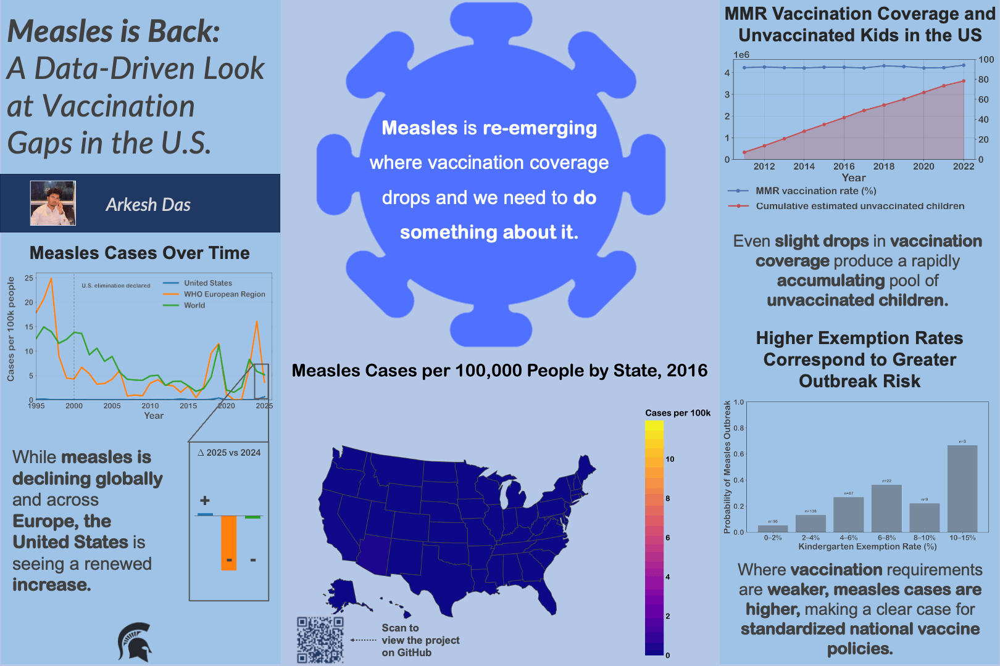

# Measles Comeback, Vaccination Gaps and Outbreak Risk in the United States

A data visualization and public health analysis project examining the re-emergence of measles in the United States and how outbreak risk relates to vaccination coverage, exemption rates, and accumulated pockets of under-vaccination.


<p align="center">
  <a href="final_presentation/final_poster.pptx">
    
  </a>
</p>

This repository is adapted from my final project for [CMSE 402: Data Visualization Principles and Techniques](https://msu-cmse-courses.github.io/cmse402-S26-student/) at Michigan State University.

## Overview

Measles is often discussed as if it simply "came back," but that framing hides an important question: where and under what conditions does outbreak risk increase?

This project uses public health and demographic data to study how measles incidence has changed over time in the United States, how those trends compare with Europe and the world, and how state-level outbreak patterns relate to vaccination exemptions and coverage gaps. Rather than relying on one prebuilt master dataset, I assembled and aligned multiple public data sources in Python, including U.S. national case counts, WHO regional counts, state-level case data, MMR vaccination coverage, kindergarten exemption rates, births data, and population estimates.

The project was built as both a technical analysis and a visualization-driven argument. Its central claim is that weaker vaccination requirements are associated with higher outbreak risk, and that this relationship becomes clearer when the data is structured to emphasize interpretable risk rather than raw counts alone.

## Project Questions

This project focuses on three main questions:

1. How has measles incidence changed over time in the United States, and how does that compare with Europe and the world?
2. Do states with higher kindergarten exemption rates appear more likely to experience outbreaks?
3. Even when national vaccination coverage appears relatively high, how many unvaccinated children may still be accumulating over time?

## Repository Structure

```bash
.
├── LICENSE
├── README.md
├── data/
│   ├── 2024-26-state-measles-cases.csv
│   ├── 2025-state-populations.csv
│   ├── CDC-measles-by-year.csv
│   ├── NNDSS-2016-2023-state-measles-cases.csv
│   ├── WB_population_cleaned.csv
│   ├── childvax-us.csv
│   ├── childvax-us2.csv
│   ├── data_dictionary.md
│   ├── global+EU-WHO-measles-by-year.xlsx
│   ├── mmr-exemptions-state.csv
│   ├── nis-child-us.csv
│   └── number-of-births-per-year.filtered/
├── draft_presentation/
│   ├── draft_feedback.md
│   └── draft_poster.pptx
├── draft_visualizations/
│   ├── initial_draft_feedback.md
│   ├── fig1_measles_cases.png
│   ├── fig1_measles_cases_per_100k.png
│   ├── fig2_vaccination_rates.png
│   ├── fig3_vax_unvaccinated.png
│   ├── fig3_vax_unvaccinated_cumulative.png
│   ├── fig4_measles_map_2025.html
│   └── fig4_measles_map_2025.png
├── final_presentation/
│   ├── final_poster.gif
│   ├── final_poster.pdf
│   └── final_poster.pptx
├── final_visualizations/
│   ├── fig1_measles_cases_per_100k.png
│   ├── fig2_exemption_outbreak_probability.png
│   ├── fig3_vax_unvaccinated_cumulative.png
│   ├── fig4_measles_map_2016_per100k.png
│   ├── fig4_measles_map_2017_per100k.png
│   ├── fig4_measles_map_2018_per100k.png
│   ├── fig4_measles_map_2019_per100k.png
│   ├── fig4_measles_map_2020_per100k.png
│   ├── fig4_measles_map_2021_per100k.png
│   ├── fig4_measles_map_2022_per100k.png
│   ├── fig4_measles_map_2023_per100k.png
│   ├── fig4_measles_map_2024_per100k.png
│   ├── fig4_measles_map_2025_per100k.png
│   ├── fig4_measles_map_2026_per100k.png
│   ├── final_vis.ipynb
│   └── measles_animation.gif
└── final_writeup/
    └── final_writeup_measles_project.md
```

### Folder Guide

#### [`data/`](data/)

Source datasets used in the project, along with the full [data dictionary](data/data_dictionary.md), which documents provenance, source links, variables used, processing notes, and which files feed into which figures.

#### [`draft_visualizations/`](draft_visualizations/)

Early visual experiments, intermediate figures, and revision-stage outputs. I kept these materials to preserve part of the design process and show how the final visualizations evolved through iteration.

#### [`draft_presentation/`](draft_presentation/)

Draft poster materials and presentation feedback from an earlier project stage.

#### [`final_visualizations/`](final_visualizations/)

The main analytical output folder. This contains the final figures, the year-by-year state incidence maps, the measles animation GIF, and the primary notebook, [`final_vis.ipynb`](final_visualizations/final_vis.ipynb), used for the final analysis and figure generation.

#### [`final_presentation/`](final_presentation/)

The final poster in [PDF](final_presentation/final_poster.pdf) and [PowerPoint](final_presentation/final_poster.pptx), and [GIF](final_presentation/final_poster.gif) formats.

**Note:** the animation included in the project is not viewable in the PDF poster. To view the GIF-based component as intended, open the PowerPoint version or the GIF.

#### [`final_writeup/`](final_writeup/)

The final written reflection and project summary, available here: [`final_writeup_measles_project.md`](final_writeup/final_writeup_measles_project.md).

## Methods

A major part of this project was data cleaning, reconciliation, and integration across fragmented public health sources. Instead of working from one ready-made analysis table, I built the final workflows by reshaping and merging multiple datasets in Python.

The main analytical steps included:

* reshaping wide-format public health tables into long format for analysis
* merging case counts with population denominators to calculate incidence per 100,000
* combining multiple state-level measles case sources across different year ranges
* excluding non-comparable geographic rows such as territories and New York City
* harmonizing naming inconsistencies across datasets
* transforming exemption percentages into interpretable bins
* defining a state-year outbreak indicator from incidence thresholds
* estimating annual and cumulative numbers of unvaccinated children using births and MMR coverage

The final project combines national case data from the CDC, international data from the WHO, state-level case data from the CDC and NNDSS, vaccination coverage data from CDC ChildVax, kindergarten exemption data, births data, and Census population estimates. More detailed dataset-level documentation is available in the [data dictionary](data/data_dictionary.md).

## Visualization and Design Approach

Because this project was developed in a data visualization course, the design choices were as important as the analytical ones. I was not just trying to show the data, I was trying to structure it in a way that made the underlying public health story more interpretable.

A few of the main design decisions were:

* **Normalization where comparison required fairness**
  Measles case counts were converted to incidence per 100,000 when comparing across countries or states, so larger populations would not dominate interpretation simply because they are larger.

* **Absolute counts where scale itself mattered**
  In the vaccination coverage analysis, I intentionally used estimated counts of unvaccinated children rather than only percentages, because the cumulative real-world scale of under-vaccination was part of the argument.

* **Probability instead of a noisy scatterplot**
  For the exemption analysis, I moved away from a raw scatter-based view and instead used binned outbreak probability. This made the relationship easier to interpret while still making the level of support visible.

* **Narrative sequencing across figures**
  The final visuals were structured as a sequence of evidence, moving from broad temporal context, to policy-related outbreak risk, to cumulative vulnerability, to geographic patterning at the state level.

These decisions were shaped by recurring themes from the course, especially ideas from Tufte, Cairo, Cleveland and McGill, Segel and Heer, and *Data Feminism*. Across the semester, one of the biggest lessons for me was that visualization is rarely about following a single rigid philosophy. Good design usually comes from balancing competing priorities, like completeness versus clarity, minimalism versus guidance, and raw detail versus interpretability.

## Final Deliverables

### Final notebook

[`final_visualizations/final_vis.ipynb`](final_visualizations/final_vis.ipynb)

The main notebook used to clean, merge, analyze, and visualize the project data.

### Final writeup

[`final_writeup/final_writeup_measles_project.md`](final_writeup/final_writeup_measles_project.md)

A written summary of the project’s goals, findings, design choices, and lessons learned.

### Final poster

[`final_presentation/final_poster.pdf`](final_presentation/final_poster.pdf)
[`final_presentation/final_poster.pptx`](final_presentation/final_poster.pptx)
[`final_presentation/final_poster.gif`](final_presentation/final_poster.gif)

Presentation-ready versions of the project.

### Data dictionary

[`data/data_dictionary.md`](data/data_dictionary.md)

Detailed documentation of the datasets, source links, columns used, processing steps, and figure dependencies.

## Data Sources

This project draws from publicly available data from sources including:

* Centers for Disease Control and Prevention, CDC
* World Health Organization, WHO
* National Notifiable Diseases Surveillance System, NNDSS
* U.S. Census Bureau
* Our World in Data
* United Nations / World Population Prospects
* World Bank derived population datasets

A complete source list with dataset-specific notes is available in the [data dictionary](data/data_dictionary.md).

## Reproducibility Notes

This repository preserves the overall project structure used during development, including draft artifacts and intermediate outputs. The final figures were generated through Python-based workflows in the included notebook, with cleaning and merging performed programmatically rather than through a single saved master dataset.

Some public health and demographic data required manual filtering, alignment, or supplementation to make year ranges and geographic units comparable. Those decisions are documented in the [data dictionary](data/data_dictionary.md) and discussed further in the [final writeup](final_writeup/final_writeup_measles_project.md).

## Course Context

This repository is a cleaned public adaptation of a final project from [CMSE 402: Data Visualization Principles and Techniques](https://msu-cmse-courses.github.io/cmse402-S26-student/). In addition to public health analysis, the project reflects course themes around truthful representation, context, visual perception, audience guidance, and the tradeoffs involved in making complex data interpretable.

## Author

**Arkesh Das**

## License

This project is released under the MIT License. See the [LICENSE](LICENSE) file for details.